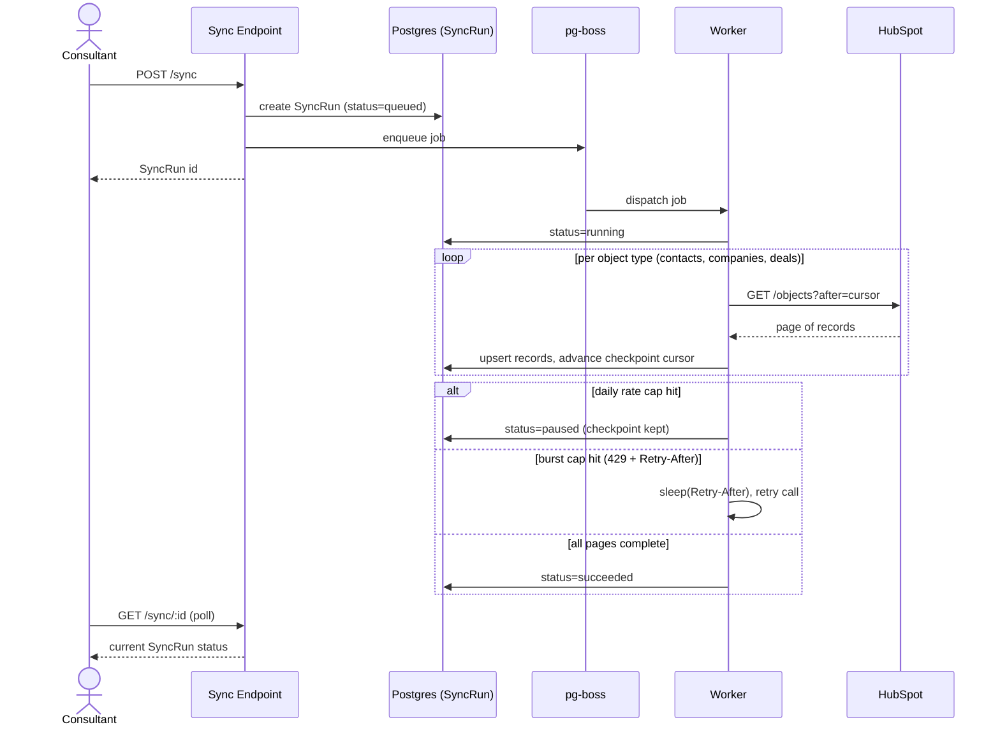
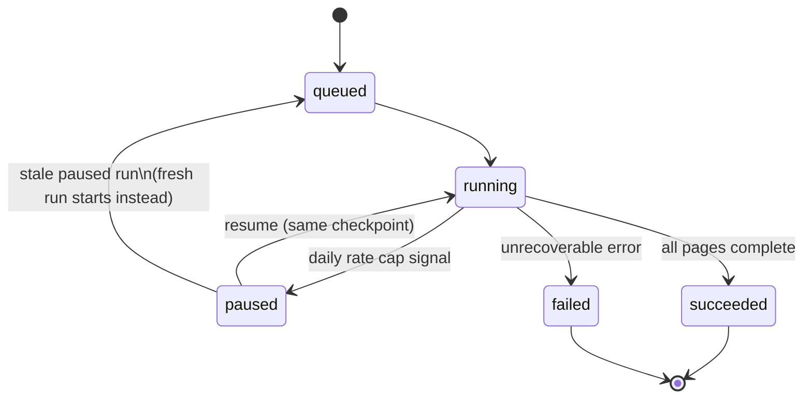
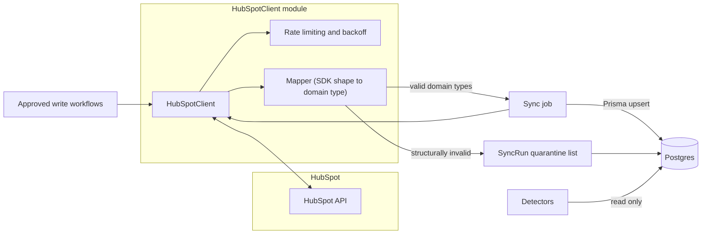
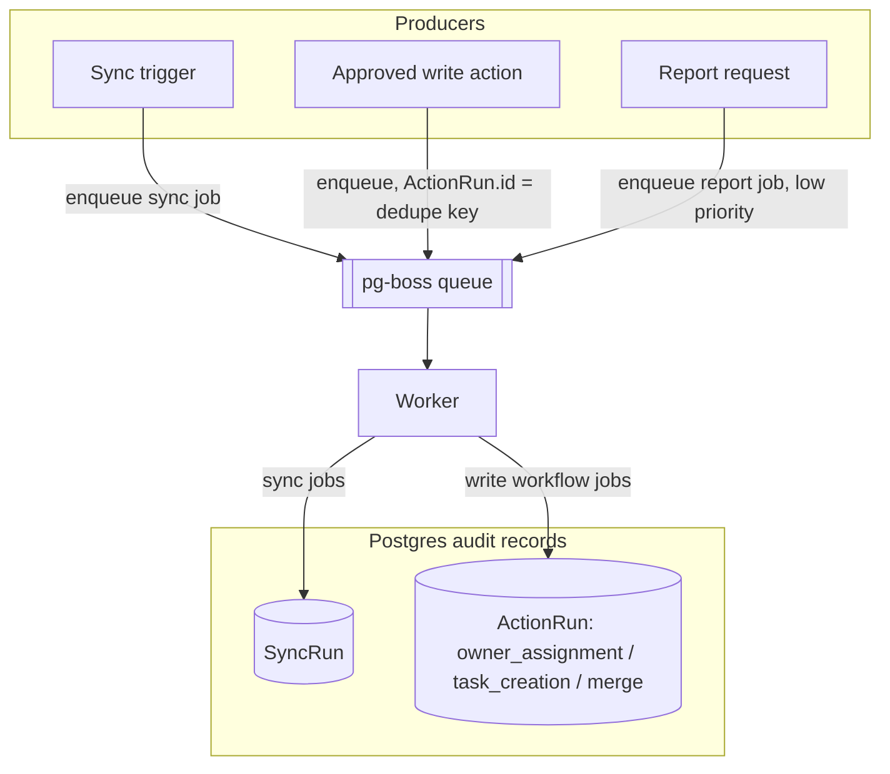

# Architecture

System design for the sync pipeline, CRM integration boundary, and background job processing. Rationale and alternatives considered are in `decisions/0001-sync-adapter-queue.md`.

## Sync Strategy

**Trigger:** On-demand only. The consultant triggers a sync via API before running an audit. No scheduler, no webhooks — ongoing monitoring is out of MVP scope.

**Execution model:** Queued, not inline.

1. Consultant calls the sync endpoint.
2. A `SyncRun` row is created (status `queued`) and a pg-boss job is enqueued.
3. The endpoint returns the `SyncRun` id immediately; the client polls it for status.
4. The worker processes the job, updating the `SyncRun` as it progresses.

**Incremental mechanism:** List API with cursor pagination (`after` param), not the Search API. Every sync run re-pages every object type in full; records are compared against the stored last-sync timestamp before writing. This makes "incremental" mean *fewer DB writes*, not *fewer API calls* — every run still re-fetches everything. Acceptable at MVP data volumes; avoids the Search API's stricter 5 req/s cap entirely.

**Checkpointing:** `SyncRun` persists a pagination cursor per object type (contacts, companies, deals) as the job progresses. A retried or resumed job continues from the last checkpoint rather than restarting from page 1.

**Rate limiting (inside `HubSpotClient`, reactive, dual-cap):**

| Cap | Signal | Response |
|---|---|---|
| Burst (100 req/10s) | `429` + `Retry-After` | Sleep for `Retry-After`, then retry the call. |
| Daily (shared account-wide) | `X-HubSpot-RateLimit-Daily-Remaining` header running low, or a daily-cap-specific `429` | Stop immediately — do not retry-loop. Mark the `SyncRun` `paused`, keep the checkpoint. |

The client must distinguish which cap a `429` represents — sleeping and retrying against an exhausted daily cap just wastes time until tomorrow's reset. *(Verify during implementation that `X-HubSpot-RateLimit-Daily-Remaining` is actually returned on Private App token calls.)*

No proactive call-counting or pre-counting of daily usage — purely reactive to HubSpot's own signals.

**Resume:** Triggering a sync for a scope with an existing `paused` `SyncRun` resumes it from checkpoint, unless that run is stale (default threshold TBD at implementation, ~24–48h), in which case a fresh run starts instead, since the underlying data has likely drifted.

**`SyncRun` record (Postgres):** status (`queued` / `running` / `paused` / `succeeded` / `failed`), per-object-type counts and checkpoint cursors, quarantine list, timestamps. Distinct from pg-boss's internal job table, which is queue-infrastructure, not an audit surface.

## CRM Adapter Boundary

A concrete `HubSpotClient`, not a generic `CrmPort` interface. No abstraction is introduced for a hypothetical second CRM provider — Salesforce is stretch-only, not committed, and CLAUDE.md scopes this to "implement HubSpot only."

Rules enforced on the boundary:

1. `HubSpotClient` returns only this codebase's own domain types — never HubSpot SDK/API response shapes.
2. Nothing outside the client's module imports the HubSpot SDK.
3. The client is injected (constructor/parameter) wherever it's used, so tests substitute a fake.
4. Only the sync job and the approved write workflows call it. Detectors read exclusively from Postgres and never touch the adapter.

Detectors never call `HubSpotClient` directly — they only ever read from Postgres, per rule 4 above.

**Validation in the mapper (SDK shape → domain type):**

- **Structural validation only.** A record is rejected/quarantined if it's missing an id, has wrong types, or the response is unparseable.
- **Data-quality issues pass through unchanged.** Malformed emails, blank fields, inconsistent formats are *not* cleaned, normalized, or dropped by the mapper — detecting these is the product. If the mapper fixes or discards them, the detectors (task 1.4+) never see them.
- Quarantined records are recorded in the `SyncRun`'s quarantine list — visible, never silently lost.

**Domain types vs. Prisma models:** Kept distinct, with an explicit mapping step in the sync job from adapter domain type to Prisma upsert input. Prisma models carry fields with no HubSpot equivalent (health scores, sync metadata); collapsing the two would leak persistence concerns across the adapter boundary.

**Rate limiting and backoff** (see Sync Strategy) live inside `HubSpotClient` itself, transparent to every caller — implemented once, not duplicated in the sync job and each write workflow.

## Job Queue

**Technology:** pg-boss (Postgres-backed), not Redis/BullMQ. Avoids a second piece of infrastructure (process, backup, `docker-compose` service) beyond the PostgreSQL already in the stack; MVP job volume doesn't need Redis-grade throughput.

**What runs through it:**

- Sync jobs (now).
- Approved write workflows — owner assignment, follow-up task creation, duplicate merge (task 2.x onward) — each with its own `ActionRun` record.
- Report generation — queued too, but lower priority; can be deferred past MVP if time-boxed out.

**Idempotency is the application's responsibility, not a side effect of queuing:**

- Each approved action gets a DB row at approval time; that row's id doubles as the pg-boss job's singleton/dedupe key, so enqueueing is idempotent by construction — no separately generated idempotency key.
- Before executing, an action is revalidated against current state (stale-recommendation check) — mechanism deferred to task 2.8.
- Before retrying an *uncertain* merge specifically, current record state is checked first; an already-completed merge is treated as reconciliation, never reissued (see `project.md`'s Duplicate Merge Workflow).

**`ActionRun` record:** One generic table, not one per workflow type — a type discriminator (`owner_assignment` / `task_creation` / `merge`), status, result, and a nullable JSON column for type-specific data (e.g. the merge pre-merge snapshot). Mirrors `SyncRun`. Only merge needs the bulky snapshot, so a shared table avoids three near-duplicate schemas while keeping "all approved actions" queryable in one place.
